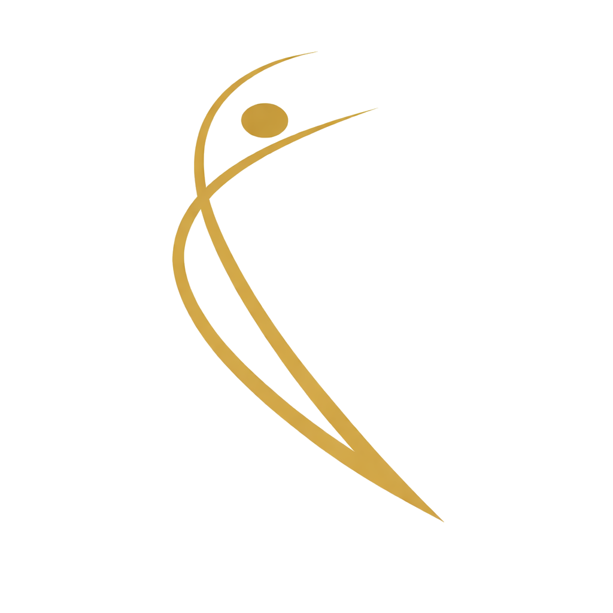
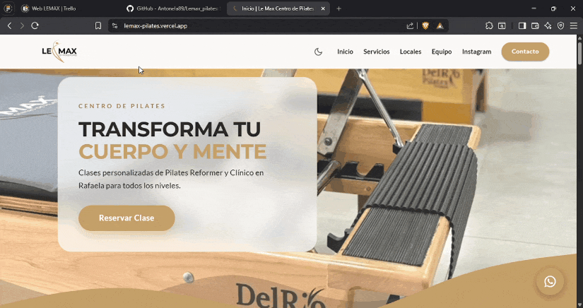
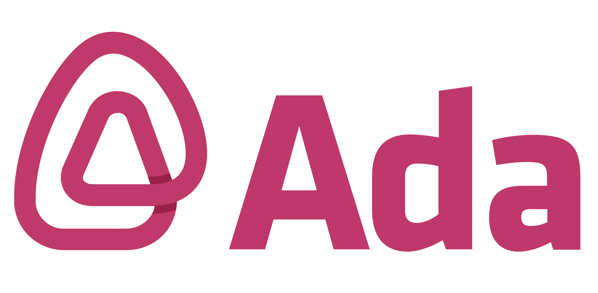

<p align="center">
  
</p>

## Experiencia digital para bienestar y movimiento

<table align="center">
  <tr>
    <td align="center">
      <br/>
      <strong>Modo claro</strong>
    </td>
    <td align="center">
      <br/>
      <strong>Modo oscuro</strong>
    </td>
  </tr>
</table>

---

## Deploy

<p align="center">
  <a href="https://lemax-pilates.vercel.app/" target="_blank">
    
  </a>
</p>

<p align="center">
  https://lemax-pilates.vercel.app/
</p>

---

<p align="center">
  
  
  
  
  
</p>

---

Aplicación web desarrollada en **React** como trabajo final de la cátedra **Front-End de ADA**, basada en un caso real: un estudio de pilates que requería una presencia digital moderna, clara y funcional.

El proyecto consistió en diseñar e implementar una solución digital centrada en la experiencia de usuario, utilizando una arquitectura de componentes reutilizables, manejo de datos estructurados y buenas prácticas de desarrollo Front-End.
##  Índice


- [Experiencia digital para bienestar y movimiento](#experiencia-digital-para-bienestar-y-movimiento)
- [Deploy](#deploy)
- [Índice](#índice)
- [Tecnologías](#tecnologías)
  - [Frontend](#frontend)
  - [UI / Estilos](#ui--estilos)
  - [Herramientas y entorno](#herramientas-y-entorno)
  - [Manejo de datos](#manejo-de-datos)
- [Estructura del proyecto](#estructura-del-proyecto)
- [Características principales](#características-principales)
- [Características técnicas](#características-técnicas)
- [Arquitectura del proyecto](#arquitectura-del-proyecto)
- [Desafío del proyecto](#desafío-del-proyecto)
- [Instalación](#instalación)
- [Autoras](#autoras)


## Tecnologías

###  Frontend
-  React  
-  JavaScript (ES6+)  
-  HTML5  
-  CSS3  

###  UI / Estilos
-  Material UI (MUI)  
-  Theming (modo claro / oscuro)  
-  Responsive Design  

###  Herramientas y entorno
-  Vite  
-  Git  
-  GitHub  

###  Manejo de datos
-  JSON  
---

##  Estructura del proyecto

```
Lemax_Pilates/
│
├── node_modules/
├── public/
│   └── logo.png
│
├── src/
│   ├── assets/
│   ├── components/
│   ├── data/
│   ├── features/
│   ├── theme/
│   ├── utils/
│   │
│   ├── App.jsx
│   ├── main.jsx
│   └── index.css
│
├── .env.example
├── .gitignore
├── .prettierrc
├── eslint.config.js
├── index.html
├── jsconfig.json
├── package.json
├── package-lock.json
├── vite.config.js
└── README.md
```

---

## Características principales

*  Visualización dinámica de sedes desde archivos JSON
*  Sección de reseñas de clientes
*  Información de contacto accesible
*  Información sobre servicios y disciplinas ofrecidas
*  Presentación de instructores calificados
*  Beneficios del método Pilates
*  Diseño moderno con estética wellness

---

## Características técnicas

*  Arquitectura basada en componentes reutilizables
*  Manejo de datos desacoplado mediante JSON
*  Renderizado condicional para estados de carga (Skeleton)
*  Implementación de theming dinámico (modo claro / oscuro)
*  Diseño responsive con enfoque mobile-first
*  Separación de responsabilidades (UI / lógica / datos)
*  Optimización de experiencia de usuario (UX)

---

## Arquitectura del proyecto

El proyecto está organizado siguiendo una arquitectura modular basada en funcionalidades (feature-based structure), lo que permite escalar la aplicación de forma ordenada y mantenible.

-  `features/`: contiene las distintas secciones de la aplicación (hero, reviews, locations, etc.), agrupando lógica y UI por funcionalidad  
-  `components/`: componentes reutilizables separados por responsabilidad (common y layout)  
-  `theme/`: configuración centralizada de estilos y theming  
-  `assets/`: recursos estáticos como imágenes y logos  
-  `data/`: manejo de datos desacoplado mediante JSON  

Esta organización favorece la reutilización, escalabilidad y claridad del código en proyectos de mayor tamaño.

---
## Desafío del proyecto

Este proyecto implicó abordar un escenario real, trasladando necesidades concretas de un cliente a una solución digital funcional.

* Interpretación de requerimientos reales
* Diseño de una experiencia intuitiva y accesible
* Organización eficiente de la información
* Implementación de componentes reutilizables
* Trabajo colaborativo mediante control de versiones (Git y GitHub)

Además, se aplicaron buenas prácticas de desarrollo enfocadas en escalabilidad, mantenibilidad y experiencia de usuario.

---

## Instalación

```bash
git clone https://github.com/Antonela89/Lemax_pilates.git
cd Lemax_pilates
npm install
npm run dev
```

---

## Autoras

* BORGOGNO, Antonela <a href="https://linkedin.com/in/antonela-borgogno" target="_blank">  </a>

* GIAVEDONI, Brisa <a href="https://linkedin.com/in/brisa-giavedoni" target="_blank">  </a>

* MARTINEZ H, M. Gabriela <a href="https://linkedin.com/in/magamahe" target="_blank">  </a>

---

Proyecto desarrollado como trabajo final de la cátedra **Front-End en ADA**, aplicando buenas prácticas de desarrollo, diseño UI/UX y trabajo colaborativo.

<p align="center">
  
</p>
